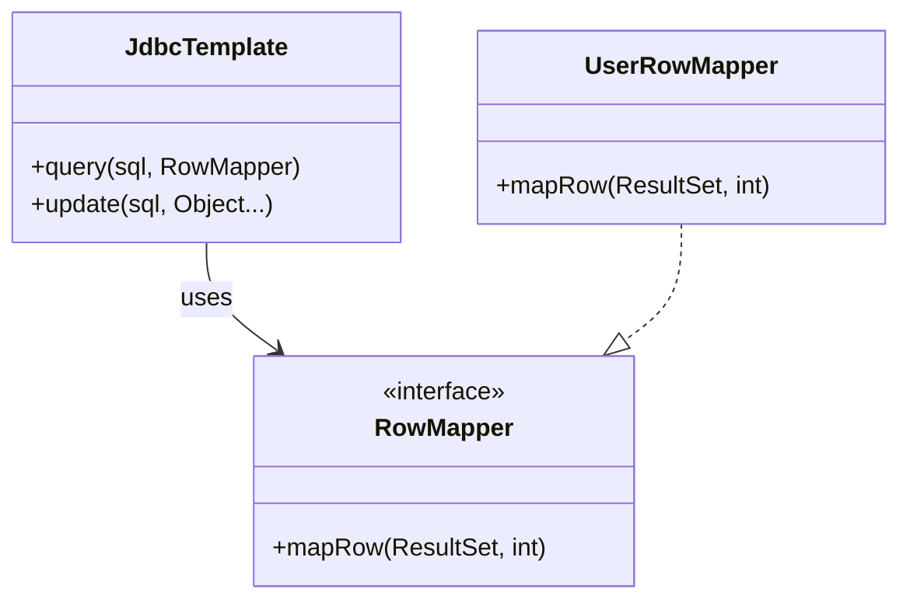

# JdbcTemplate 패턴 설명 (Spring Framework)

`JdbcTemplate`은 Spring에서 제공하는 템플릿 콜백 기반의 JDBC 처리 유틸리티입니다. 반복적인 자원 처리, 예외 처리, 연결 관리를 대신해주며, 개발자는 핵심 SQL 로직에만 집중할 수 있도록 도와줍니다.

---

## ✅ 구조 요약

- 공통 흐름: 커넥션 획득 → PreparedStatement 생성 → 실행 → 자원 반환
- 사용자 정의: SQL과 파라미터, 결과 매핑 로직 등

---

## 📌 예제

```java
@Autowired
private JdbcTemplate jdbcTemplate;

public List<User> findAllUsers() {
    String sql = "SELECT * FROM users";

    return jdbcTemplate.query(sql, (rs, rowNum) -> {
        User user = new User();
        user.setId(rs.getLong("id"));
        user.setName(rs.getString("name"));
        return user;
    });
}
```

---

## 📊 내부 구조 다이어그램 (Mermaid)



---

## ✅ 핵심 개념 요약

| 항목 | 설명 |
|------|------|
| 핵심 클래스 | `org.springframework.jdbc.core.JdbcTemplate` |
| 콜백 인터페이스 | `RowMapper`, `PreparedStatementSetter`, `ResultSetExtractor` 등 |
| 장점 | 반복 제거, 자원 해제 자동화, 콜백 패턴 구조화 |
| 단점 | SQL이 코드에 노출되어 유지보수 어려움 (MyBatis나 JPA로 보완) |

---

## ✅ 결론

`JdbcTemplate`은 **템플릿 콜백 패턴의 대표적인 사례**로, Spring에서 JDBC 접근의 복잡성을 크게 줄여줍니다.
