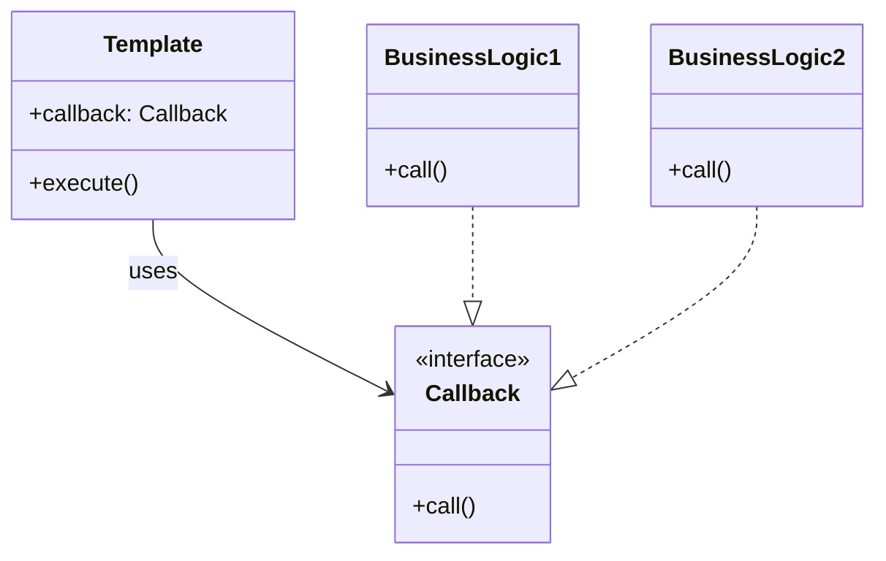

# 템플릿 콜백 패턴 (Template Callback Pattern)

템플릿 콜백 패턴은 공통된 처리 흐름(템플릿)은 유지하면서, 그 안의 변하는 부분을 콜백으로 분리하는 설계 패턴입니다.

---

## 💡 핵심 개념

- **템플릿**: 고정된 흐름을 제공
- **콜백**: 흐름 중 일부를 외부에서 주입

---

## 📊 구조 다이어그램 (Mermaid)



---

## 📌 예시 (Java 8 람다식)

```java
@FunctionalInterface
interface Callback {
    void call();
}

public class Template {
    public void execute(Callback callback) {
        long start = System.currentTimeMillis();
        callback.call();  // 콜백 실행
        long end = System.currentTimeMillis();
        System.out.println("실행 시간: " + (end - start) + "ms");
    }
}

public class Main {
    public static void main(String[] args) {
        Template template = new Template();
        template.execute(() -> System.out.println("비즈니스 로직 실행"));
    }
}
```
