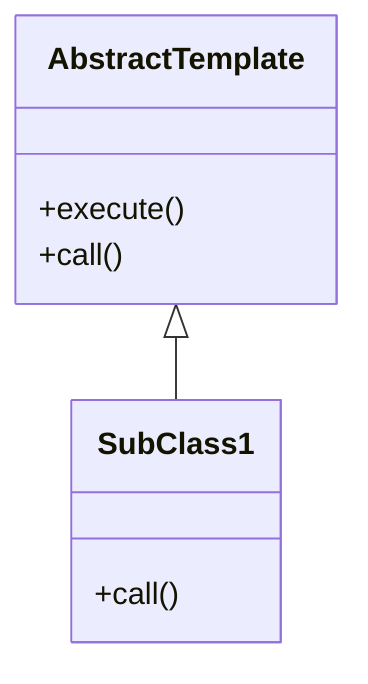
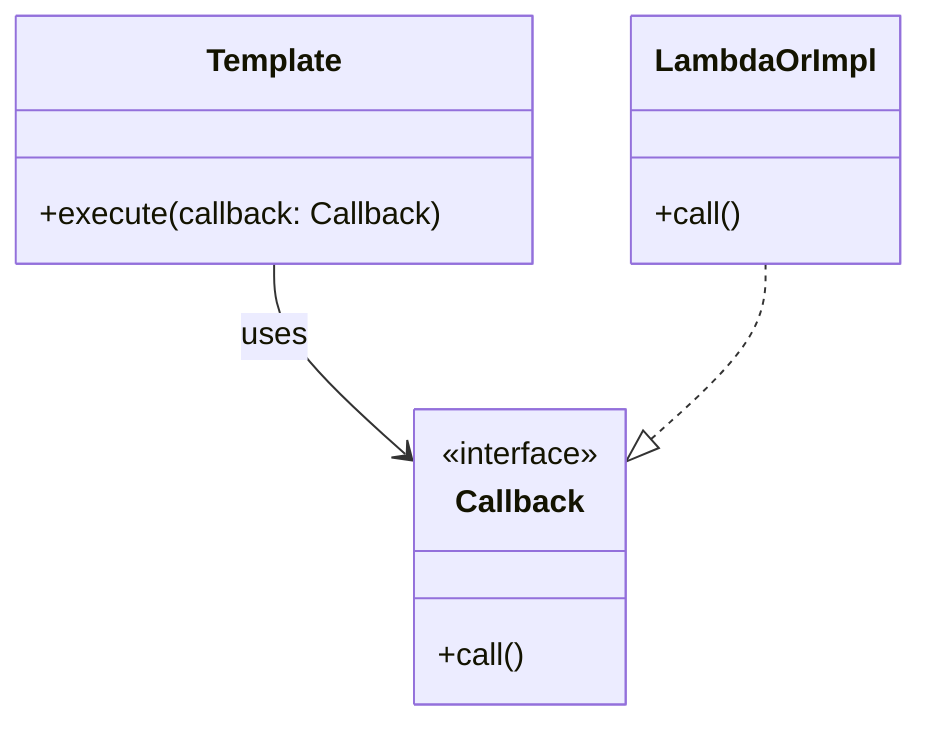

# 템플릿 메서드 패턴 vs 템플릿 콜백 패턴

두 패턴은 모두 **공통 로직(템플릿)을 고정하고, 변하는 부분을 분리**하는 목적을 가집니다. 그러나 **상속 기반**이냐 **위임 기반**이냐의 차이로 설계 방식이 크게 다릅니다.

---

## ✅ 핵심 비교

| 항목 | 템플릿 메서드 패턴 | 템플릿 콜백 패턴 |
|------|--------------------|------------------|
| 정의 위치 | 추상 클래스 내부에 고정된 템플릿 정의 | 외부에서 콜백 객체(또는 함수)를 주입 |
| 동작 방식 | 추상 메서드를 하위 클래스가 오버라이드 | 실행 시점에 전달된 콜백을 호출 |
| 확장 방식 | 상속 기반 (IS-A 관계) | 위임 기반 (HAS-A 관계, 전략 전달) |
| 유연성 | 낮음 | 높음 |
| 대표 예시 | `abstract class + templateMethod()` | `execute(callback)` 형태 |
| 주요 활용 | 전통적인 Java 설계, 상속 구조 | Java 8+, 스프링 템플릿 등 함수형 활용 |

---

## 📊 구조 비교 (Mermaid)

### 템플릿 메서드 패턴

---

### 템플릿 콜백 패턴

---

## ✅ 결론 요약

- 템플릿 메서드 패턴: 상속 중심 → 구조 고정 → 유연성 낮음
- 템플릿 콜백 패턴: 조합 중심 → 함수 전달 → 유연성 높음 (특히 Java 8 이후 사용 빈도 증가)
